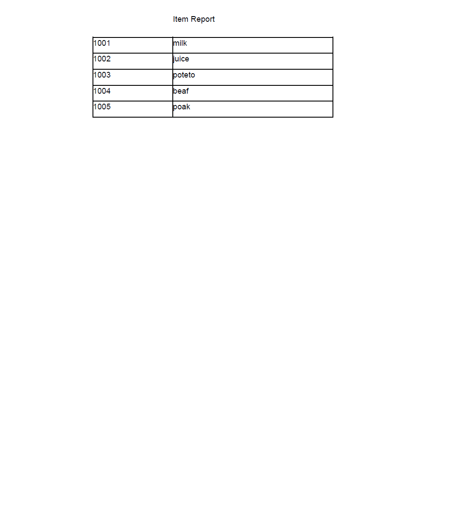
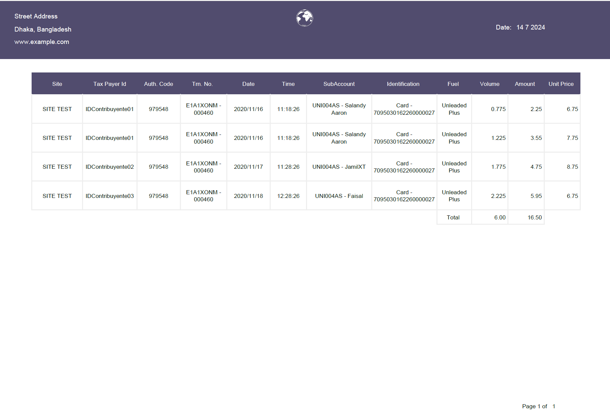

# Jasper Reportsによる帳票出力のSpring Boot APサンプル
* Jasper Reportsを使って、帳票出力を行うためのサンプルAPです。Jasper Reportsの勉強するために作成しています。

## サンプルAPの起動方法
* Spring Boot APを起動します。
    * Spring Tool Suite（Eclipse）の場合
        * `JasperReportsSampleApplication.java`を右クリックして、`Run As` -> `Spring Boot Application`（または`Java Application`）を選択します。
        
    * コマンドラインの場合
        * プロジェクトのルートディレクトリに移動して、以下のコマンドを実行します。
            ```bash
            mvnw spring-boot:run
            ```

* ブラウザで以下のURLにアクセスします。
    * http://localhost:8080/

* トップ画面より、帳票名のリンクをクリックすると、PDFがダウンロード、表示されます。

## 帳票の例
* 今後、帳票を追加していく予定です

    * 商品一覧
        * 「items.pdf」という名前のPDFファイルがダウンロードされます。

        * 出力される帳票のイメージ
            

    * 取引一覧
        * 「transactions.pdf」という名前のPDFファイルがダウンロードされます。

        * 出力される帳票のイメージ
            

## 帳票様式の確認・編集方法
* 帳票様式を確認・編集したい場合は、Jasper Studioをインストールしてください。Jasper Studioは、Eclipseベースの帳票デザインツールです。 

* Jasper Studioのダウンロード方法
    * [Jaspersoft Comunity Edtion ダウンロードサイト](https://community.jaspersoft.com/download-jaspersoft/community-edition/)からダウンロードします。
        * 会社のアドレスや情報を入れないとダウンロードできないようです。
        * Jaspersoftは個人との取引をしないということらしく、gmail等でアカウントと作ってしまうと[Access Deny](https://community.jaspersoft.com/access-denied/)になってしまうようです。

* ツールの使い方
    * [JasperSoftのコミュニティのドキュメントサイト](https://community.jaspersoft.com/documentation/)からドキュメントがダウンロードできます。
        * [Jasper StudioのHTMLドキュメントはこちら](https://community.jaspersoft.com/documentation/tibco-jasperreports-server-user-guide/v630/jaspersoft-studio-user-guide)

* サンプルAPの帳票様式について
    * まずは、ライブラリの利用方法の勉強のため、自分で作成せず、[参考情報](#参考情報)にあるサンプルAPのサイトの様式（jrxmlファイル）を利用させていただきました。
        * 今後、自分でJasper Studioを使って帳票様式を作成してみて勉強しながら、サンプルAPを充実化させていく予定です。

    * 様式ファイル（jrxmlファイル）は、Japsper Studio7.x.xから以前のバージョンとフォーマットが違うため、JasperReportsのライブラリも7.x.xを使うには、Jasper Studio7.x.xで作ったものである必要があるようです。
        * 既存のものはver6.x.x以前の形式だったので、Japsper Studio7.x.xで開きなおして、最新のver7.x系のフォーマットに変換したものを使っています。
  
## ライブラリの利用方法
* pom.xmlにライブラリの依存関係を追加
    * APで、JasperReportのライブラリを使用するには、まずpom.xmlで依存ライブラリを追加します。サンプルAPでは最新の7.x.xを利用しています。
    * [サンプルAPの例](pom.xml)

```xml
<?xml version="1.0" encoding="UTF-8"?>
<project …>
    …
	<properties>
		<java.version>21</java.version>		
		<jasperreports.version>7.0.0</jasperreports.version>
	</properties>
	<dependencies>	
		<!-- Jaspter Reports -->
		<dependency>
			<groupId>net.sf.jasperreports</groupId>
			<artifactId>jasperreports</artifactId>
			<version>${jasperreports.version}</version>
			<exclusions>
				<exclusion>
					<artifactId>commons-logging</artifactId>
					<groupId>commons-logging</groupId>
				</exclusion>
			</exclusions>
		</dependency>
		<!-- ver7.xより、機能ごとExtensionに分離されたので、追加定義が必要 -->
		<dependency>
			<groupId>net.sf.jasperreports</groupId>
			<artifactId>jasperreports-pdf</artifactId>
			<version>${jasperreports.version}</version>
			<exclusions>
				<exclusion>
					<artifactId>commons-logging</artifactId>
					<groupId>commons-logging</groupId>
				</exclusion>
			</exclusions>			
		</dependency>
   	</dependencies>
</project>        
```

* JasperのAPIの利用方法
    * 公式のサンプルコードやリファレンスは[JaspterReports LibraryのGitHubサイト](https://github.com/TIBCOSoftware/jasperreports?tab=readme-ov-file#jasperreports---free-java-reporting-library)を確認します。

    * とっかかりとして[参考情報](#参考情報)にあるサイトのサンプルAPを参考に、AP内でJasperReportのAPIを利用するとよいです。
    * サンプルAPだと、以下を確認するとよいです。
        * [サンプルAPの例](src/main/java/com/example/jaspersample/infra/reports/ItemsReportCreatorImplByJasperAPISimple.java)
        * 以下、抜粋
        
    ```java
    private static final String TITLE = "title";	
    private static final String REPORT_NAME = "商品一覧";
    private static final String JRXML_FILE_PATH = "classpath:reports/item-report.jrxml";
    private static final String JASPER_FILE_PATH = "item-report.jasper";

    // 商品一覧の帳票の作成例    
    @Override
    public InputStream createItemListReport(List<Item> items) {        
        JasperReport jasperReport;		
        try {
            // コンパイル済の帳票様式がある場合はそれを利用する     
            jasperReport = (JasperReport) JRLoader.loadObject(ResourceUtils.getFile(JASPER_FILE_PATH));
        } catch (FileNotFoundException | JRException e) {
            try {
                // コンパイル済の帳票様式が見つからない場合は、jrxmlの帳票様式ファイルをコンパイルする
                File jrxmlFile = ResourceUtils.getFile(JRXML_FILE_PATH);
                jasperReport = JasperCompileManager.compileReport(jrxmlFile.getAbsolutePath());
                // コンパイル済の帳票様式を保存する
                JRSaver.saveObject(jasperReport, JASPER_FILE_PATH);
            } catch (FileNotFoundException | JRException e1) {
                …
            }
        }
        // 商品リストを、データソース（JRBeanCollectionDataSource）に指定
        JRBeanCollectionDataSource dataSource = new JRBeanCollectionDataSource(items);
        Map<String, Object> parameters = new HashMap<>();
        // タイトルをパラメータに指定
        parameters.put(TITLE, REPORT_NAME);

        try {
            // 帳票様式に帳票データを渡して、帳票を作成する
            JasperPrint jasperPrint = JasperFillManager.fillReport(jasperReport, parameters, dataSource);

            // そのままバイト配列に出力する実装例
            // PDF形式で出力
            byte[] reportContent = JasperExportManager.exportReportToPdf(jasperPrint);
            return new ByteArrayInputStream(reportContent);
            
        } catch (JRException e) { // | IOException e) {
            …
        }
    }
    ```    

* フレームワークによる帳票出力機能の例
    * 上の例では、毎回帳票ごとにJasperReportのAPIを使って帳票を作成するため、帳票出力をもっと簡単に行うためのフレームワーク機能を実装している。
        * [サンプルAPの例](src/main/java/com/example/jaspersample/infra/reports/ItemsReportCreatorImpl.java)
        * 以下、抜粋

    ```java
    @Component
    // AbstractJasperReportCreatorを継承
    // 型パラメータに帳票作成に必要なデータの型を指定
    public class ItemsReportCreatorImpl extends AbstractJasperReportCreator<List<Item>> implements ItemsReportCreator {
        private static final String TITLE = "title";
        private static final String REPORT_NAME = "商品一覧";
        private static final String JRXML_FILE_PATH = "classpath:reports/item-report.jrxml";

        @Override
        public InputStream createItemListReport(List<Item> items) {
            // AbstractJasperReportCreatorが提供するcreatePDFReportメソッドをを呼び出すだけでPDF帳票作成が完了する
            return createPDFReport(items);
        }

        // AbstractJasperReportCreatorのabstractメソッドgetJRXMLFileを実装して様式ファイルのパスを返す
        @Override
        protected File getJRXMLFile() throws FileNotFoundException {
            return ResourceUtils.getFile(JRXML_FILE_PATH);
        }

        // AbstractJasperReportCreatorのabstractメソッドgetParametersを実装して、帳票作成に必要なパラメータを返す
        @Override
        protected Map<String, Object> getParameters(List<Item> data) {
            Map<String, Object> parameters = new HashMap<>();
            // タイトルをパラメータに指定
            parameters.put(TITLE, REPORT_NAME);
            return parameters;
        }

        // AbstractJasperReportCreatorのabstractメソッドgetDataSourceを実装して、データソースを返す
        @Override
        protected JRDataSource getDataSource(List<Item> data) {
            return new JRBeanCollectionDataSource(data);
        }

    }
    ```


## 日本語を出力する方法
* デフォルトのフォントだと日本語出力できないので、日本語フォントをダウンロードして指定する必要があります。
    * 日本語を利用する場合は、日本語フォントをダウンロードします。
        * [IPAフォント](https://moji.or.jp/ipafont/ipafontdownload/)
    * src/main/resources配下の任意のフォルダに、フォントファイルを配置します。
        * [サンプルAPのフォルダ](src/main/resources/fonts/)のttfファイル
    * src/main/resources配下の任意のフォルダに、フォントを定義するファイルを作成します。
        * [サンプルAPの例](src/main/resources/fonts/fontsfamily-ipa.xml)
    * この定義ファイルのfontFamilyのname属性の値と同じものを、様式ファイルのフォント名（fontName）にしておきます。
        * [サンプルAPの例](src/main/resources/reports/item-report.jrxml)
        * TODO: デザイナ（Jasper Studio）側のカスタムフォント設定も調査する
    * src/main/resources配下に、jasperreports_extension.propertiesファイルを作成し、フォントを指定します。
        * [サンプルAPの例](src/main/resources/jasperreports_extension.properties)

## 参考情報
* [Jaspersoft community editionの公式サイト](https://www.jaspersoft.com/products/jaspersoft-community)

* [NRIのOpenStandiaが提供するJaspersoft情報](https://openstandia.jp/oss_info/jaspersoft/)

* [Workbrain JAPAN](https://www.workbrainjapan.net/jasperreports-solution)
    * JasperReportsを扱っている、帳票・レポート作成ソリューションがある模様

* [JaspterReports LibraryのGitHubサイト](https://github.com/TIBCOSoftware/jasperreports)

* 日本語フォントの対応
    * [JasperReportでの日本語フォントの利用の記事](https://qiita.com/morya/items/26e1519b9ca813ed399a)
    * [IPAフォント](https://moji.or.jp/ipafont/ipafontdownload/)

* Japser Reportsを使ったチュートリアル、サンプル
    * サンプル1
        * https://howtodoinjava.com/spring-boot/spring-boot-jasper-report/
        * 完全なサンプルコード
            * https://github.com/lokeshgupta1981/Spring-Boot3-Demos/tree/main/jasper-reports-example

    * サンプル2
        * https://satyacodes.medium.com/spring-boot-reporting-with-jasper-reports-d4ed3128f0fe
        * 完全なサンプルコード
            * https://github.com/javaHelper/Build-Reports-with-JasperReports-Java-and-Spring-Boot

    * サンプル3
        * https://github.com/jamilxt/java_spring-boot_japser-report

    * サンプル4
        * https://www.baeldung.com/spring-jasper
        * 完全なサンプルコード
            * https://github.com/eugenp/tutorials/tree/master/libraries-reporting