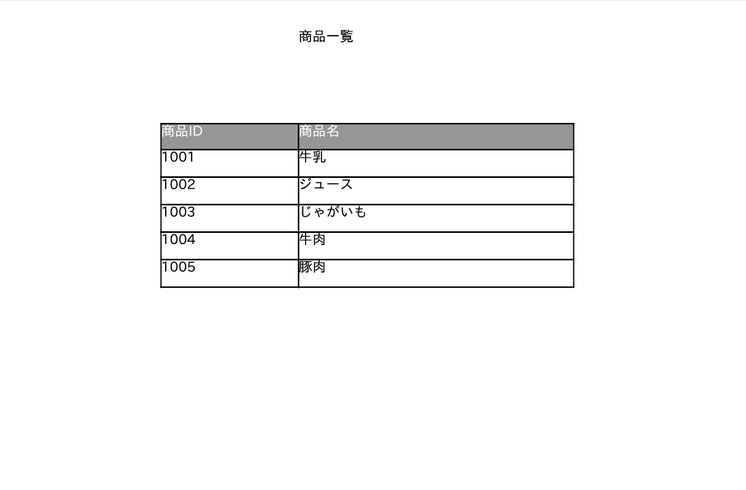
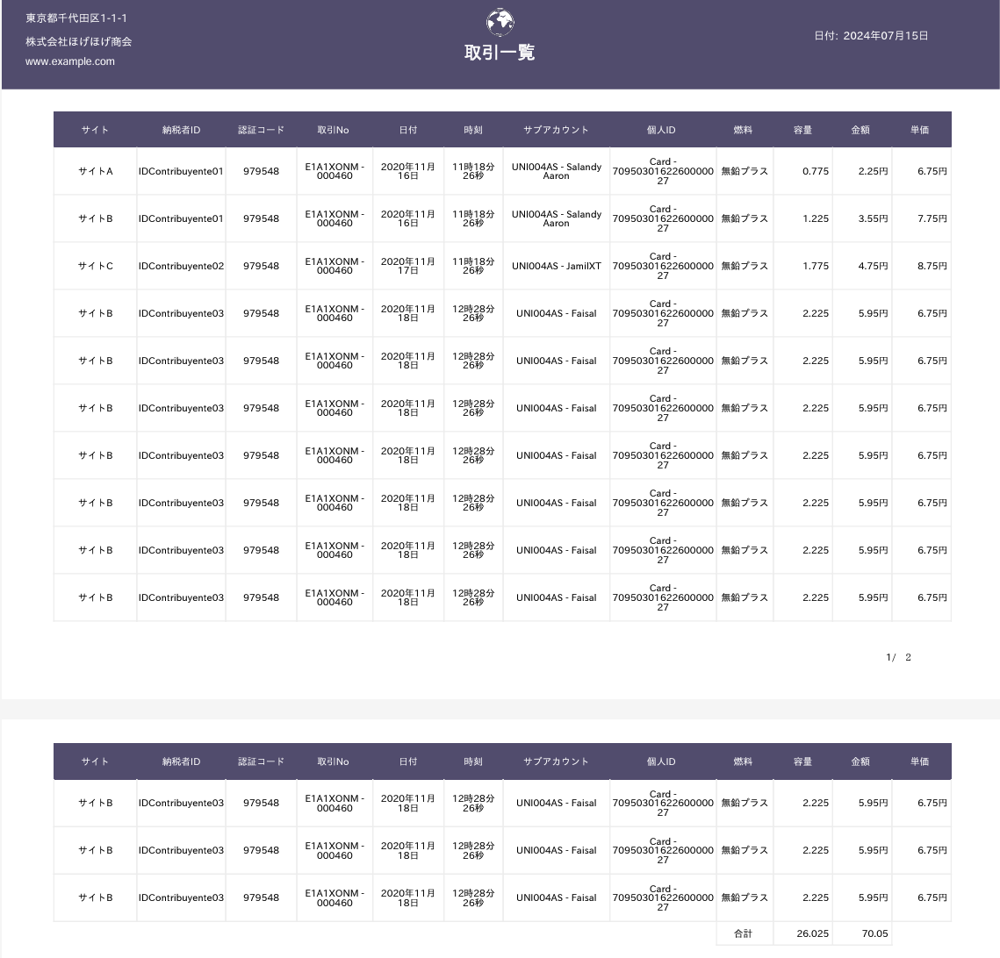

# Jasper Reportsによる帳票出力のSpring Boot APサンプル
* Jasper Reportsを使って、帳票出力を行うためのサンプルAPです。Jasper Reportsの勉強するために作成しています。

## サンプルAPの起動方法
* Spring Boot APを起動します。
    * Spring Tool Suite（Eclipse）の場合
        * `JasperReportsSampleApplication.java`を右クリックして、`Run As` -> `Spring Boot Application`（または`Java Application`）を選択します。
        
    * コマンドラインの場合
        * プロジェクトのルートディレクトリに移動して、以下のコマンドを実行します。
            ```bash
            mvnw spring-boot:run
            ```

* ブラウザで以下のURLにアクセスします。
    * http://localhost:8080/

* トップ画面より、帳票名のリンクをクリックすると、PDFがダウンロード、表示されます。

## 帳票の例
* 今後、帳票を追加していく予定です

    * 商品一覧
        * 「商品一覧.pdf」という名前のPDFファイルがダウンロードされます。
            * 実際の[PDFファイル](pdf/商品一覧.pdf)
        * 様式ファイル
            * [参考情報](#参考情報)にあるサンプルコードの様式ファイル（jrxmlファイル）を利用し修正して使用させていただきました。
            * 実際の[帳票様式(jrml)ファイル](src/main/resources/reports/item-report.jrxml)
        * 出力される帳票のイメージ

                

    * 取引一覧
        * 「取引一覧.pdf」という名前のPDFファイルがダウンロードされます。
            * 実際の[PDFファイル](pdf/取引一覧.pdf)
        * 様式ファイル
            * [参考情報](#参考情報)にあるサンプルコードの様式ファイルを利用し修正して使用させていただきました。
            * 実際の[帳票様式(jrml)ファイル](src/main/resources/reports/transaction-report.jrxml)
        * 出力される帳票のイメージ

        
            
    * 請求書
        * 「請求書.pdf」という名前のPDFファイルがダウンロードされます。
            * 実際の[PDFファイル](pdf/請求書.pdf)
                * [PDFセキュリティの設定例](#pdfのセキュリティ設定)として、読み取りパスワード「1234」で設定しています。ファイルを開く際にパスワードを入力するようになります。
            * [PDF電子署名](#pdfへの電子署名付与)の設定例として、PDFに電子署名を付与した版も用意しています。（ただし、公開鍵に対する証明書が自己署名証明書を使っているため、Acrobat Readerで開くと署名の検証で完全性が不明のため、「少なくとも１つの署名に問題があります。」の表示が出ます。）
                * [署名付与PDFファイル（基本署名での可視署名付き）](pdf/請求書_基本_可視署名.pdf)
                * [署名付与PDFファイル（PAdES署名での不可視署名付き）](pdf/請求書_PAdES_不可視署名.pdf)

        * 自分でゼロから作成した様式ファイルです。
            * 実際の帳票様式(jrml)ファイル
                * [単項目をパラメータで設定した様式バージョン](src/main/resources/reports/invoice-report.jrxml)
                * [単項目・明細ともにJRDataSourceから取得する様式バージョン](src/main/resources/reports/invoice-report.jrxml)
            * 某帳票製品の帳票サンプルを参考にして、同じようにデザインできるか試してみました。            
        * 出力される帳票のイメージ
        
        

## 帳票様式の確認・編集方法
* 帳票様式を確認・編集したい場合は、Jasper Studioをインストールしてください。Jasper Studioは、Eclipseベースの帳票デザインツールです。 

* Jasper Studioのダウンロード方法
    * [Jaspersoft Comunity Edtion ダウンロードサイト](https://community.jaspersoft.com/download-jaspersoft/community-edition/)からダウンロードします。
        * 会社のアドレスや情報を入れないとダウンロードできないようです。
        * Jaspersoftは個人との取引をしないということらしく、gmail等でアカウントと作ってしまうと[Access Deny](https://community.jaspersoft.com/access-denied/)になってしまうようです。

* ツールの使い方
    * [JasperSoftのコミュニティのドキュメントサイト](https://community.jaspersoft.com/documentation/)からドキュメントがダウンロードできます。
        * [Jasper StudioのHTMLドキュメントはこちら](https://community.jaspersoft.com/documentation/jaspersoft%C2%AE-studio/tibco-jaspersoft-studio-user-guide/v900/jss-user-_-getting-started/)

* 古いバージョンの帳票様式について
    * 最初は、ライブラリの利用方法の勉強のため、自分でゼロから作成せず、[参考情報](#参考情報)にあるサンプルコードの様式ファイル（jrxmlファイル）を利用し修正して使用させていただきました。
    * [参考情報](#参考情報)のサンプルコードの様式ファイル（jrxmlファイル）は、Japsper Studio7.x.xから以前のバージョンとフォーマットが違うため、JasperReportsのライブラリも7.x.xを使うには、Jasper Studio7.x.xで作ったものである必要があるようです。
        * 既存のものはver6.x.x以前の形式だったので、Japsper Studio7.x.xで開きなおして、最新のver7.x系のフォーマットに変換したものを使っています。

## Jasper Reportsの概念
* Jaspersoft Studioのマニュアルにある[Concepts of JasperReports - Data Sources and Print Formats](https://community.jaspersoft.com/documentation/jaspersoft%C2%AE-studio/tibco-jaspersoft-studio-user-guide/v900/jss-user-_-data-sources-print-formats/#jss-user_basicnotions_2905227221_1018389)の記載が分かりやすいです。
    * JasperReportsでは、Jaspersoft Studioでデザインした帳票をjrxmlというXML形式で保存します。    
    * Javaのコードでは、jrxmlファイルをコンパイルしjasperファイルを生成します。
    * Jasperファイルに、帳票様式に定義したパラメータデータ(Map)と、帳票様式が参照するデータソース（JavaBeanのコレクションデータやDB等のJRDataSourceインタフェース）を帳票出力するデータとして渡すことで、帳票オブジェクト(JasperPrint)を作成します。
    * 帳票オブジェクト(JasperPrint)を、PDFやExcel等の形式にエクスポートすることで、帳票を出力します。


## ライブラリの利用方法
* pom.xmlにライブラリの依存関係を追加
    * APで、JasperReportのライブラリを使用するには、まずpom.xmlで依存ライブラリを追加します。サンプルAPでは最新の7.x.xを利用しています。
        * SpringBootではlogback実装で動作するため、commons-loggingのjarを除外しておきます。
    * [サンプルAPの例](pom.xml)    

```xml
<?xml version="1.0" encoding="UTF-8"?>
<project …>
    …
    <properties>
        <java.version>21</java.version>
        <jasperreports.version>7.0.3</jasperreports.version>
    </properties>
    <dependencies>
        …
        <!-- Jaspter Reports -->
        <dependency>
            <groupId>net.sf.jasperreports</groupId>
            <artifactId>jasperreports</artifactId>
            <version>${jasperreports.version}</version>
            <exclusions>
                <exclusion>
                    <artifactId>commons-logging</artifactId>
                    <groupId>commons-logging</groupId>
                </exclusion>
            </exclusions>
        </dependency>
        <!-- ver7.xより、機能ごとExtensionに分離されたので、PDFExtensionの追加定義が必要 -->
        <dependency>
            <groupId>net.sf.jasperreports</groupId>
            <artifactId>jasperreports-pdf</artifactId>
            <version>${jasperreports.version}</version>
            <exclusions>
                <exclusion>
                    <artifactId>commons-logging</artifactId>
                    <groupId>commons-logging</groupId>
                </exclusion>
            </exclusions>
        </dependency>
        <!-- PDFのパスワード設定する場合に、bouncycastleを利用するため追加定義が必要 -->
        <dependency>
            <groupId>org.bouncycastle</groupId>
            <artifactId>bcprov-jdk18on</artifactId>
        </dependency>
</project>        
```

* Jasper ReportsのAPIの利用方法
    * 公式のサンプルコードやリファレンスは[JaspterReports LibraryのGitHubサイト](https://github.com/TIBCOSoftware/jasperreports?tab=readme-ov-file#jasperreports---free-java-reporting-library)を確認します。

    * とっかかりとして[参考情報](#参考情報)にあるサイトのサンプルAPを参考に、AP内でJasperReportのAPIを利用するとよいです。
    * サンプルAPだと、以下を確認するとよいです。
        * [サンプルAPの例](src/main/java/com/example/jaspersample/infra/reports/ItemsReportCreatorImplByJasperAPISimple.java)
        * 以下、抜粋
        
    ```java
    private static final String TITLE = "title";	
    private static final String REPORT_NAME = "商品一覧";
    private static final String REPORT_FILE_NAME = "商品一覧.pdf";
    private static final String JRXML_FILE_PATH = "classpath:reports/item-report.jrxml";
    private static final String JASPER_FILE_PATH = "item-report.jasper";

    // 商品一覧の帳票の作成例    
    @Override
    public ReportFile createItemListReport(List<Item> items) {        
        JasperReport jasperReport;		
        try {
            // コンパイル済の帳票様式がある場合はそれを利用する     
            jasperReport = (JasperReport) JRLoader.loadObject(ResourceUtils.getFile(JASPER_FILE_PATH));
        } catch (FileNotFoundException | JRException e) {
            try {
                // コンパイル済の帳票様式が見つからない場合は、jrxmlの帳票様式ファイルをコンパイルする
                File jrxmlFile = ResourceUtils.getFile(JRXML_FILE_PATH);
                jasperReport = JasperCompileManager.compileReport(jrxmlFile.getAbsolutePath());
                // コンパイル済の帳票様式を保存する
                JRSaver.saveObject(jasperReport, JASPER_FILE_PATH);
            } catch (FileNotFoundException | JRException e1) {
                …
            }
        }
        // 商品リストを、データソース（JRBeanCollectionDataSource）に指定
        JRBeanCollectionDataSource dataSource = new JRBeanCollectionDataSource(items);
        Map<String, Object> parameters = new HashMap<>();
        // タイトルをパラメータに指定
        parameters.put(TITLE, REPORT_NAME);

        try {
            // 帳票様式に帳票データを渡して、帳票を作成する
            JasperPrint jasperPrint = JasperFillManager.fillReport(jasperReport, parameters, dataSource);

            // そのままバイト配列に出力する実装例
            // PDF形式で出力
            byte[] reportContent = JasperExportManager.exportReportToPdf(jasperPrint);
            InputStream is = new ByteArrayInputStream(reportContent);
            return ReportFile.builder()//
                    .inputStream(is)//
                    .fileSize(reportContent.length)//
                    .fileName(REPORT_FILE_NAME)//
                    .build();

        } catch (JRException e) { // | IOException e) {
            …
        }
    }
    ```    

## 帳票出力のソフトウェアフレームワーク機能
* 上の例では、毎回帳票ごとにJasperReportのAPIを使って帳票を作成することになります。
* 業務AP側では、JasperReportのAPIをあまり意識せずに簡単に実装可能にしたいため、このサンプルAPでは、帳票出力のフレームワーク機能を実装しています。
    * 帳票出力のフレームワーク機能の実装例は[こちら](src/main/java/com/example/fw/common/reports/)

### JavaBeanをデータソースにした実装例
* フレームワーク機能を利用した帳票出力の例を示します。
    * JRBeanCollectionDataSource（JavaBeanをデータソース）による[サンプルコード](src/main/java/com/example/jaspersample/infra/reports/InvoiceReportCreatorImpl.java)    

    ```java
    // @ReportCreatorを付与し、Bean定義    
    @ReportCreator(id = "R003", name = "請求書")
    // AbstractJasperReportCreatorを継承
    // 型パラメータに帳票作成に必要なデータの型を指定
    public class InvoiceReportCreatorImpl extends AbstractJasperReportCreator<Order> implements BillingReportCreator {
        private static final String JRXML_FILE_PATH = "classpath:reports/invoice-report.jrxml";

        // 業務APが定義する帳票出力処理
        @Override
        public ReportFile createInvoice(Order order) {
            // PDFのセキュリティ設定のオプション例
            PDFOptions options = PDFOptions.builder()//
                    // 読み取りパスワード
                    .userPassword(order.getCustomer().getPdfPassword())//                   
                    .build();
            // AbstractJasperReportCreatorが提供するcreatePDFReportメソッドをを呼び出すとPDF帳票作成する            
            Report report = createPDFReport(order, options);
            return ReportFile.builder()//
                    .inputStream(report.getInputStream())//
                    .fileName(INVOICE_FILE_NAME)//
                    .fileSize(report.getSize())//
                    .build();            
        }

        // AbstractJasperReportCreatorのabstractメソッドgetJRXMLFileを実装して様式ファイルのパスを返す
        @Override
        protected File getJRXMLFile() throws FileNotFoundException {
            return ResourceUtils.getFile(JRXML_FILE_PATH);
        }

        // AbstractJasperReportCreatorのabstractメソッドgetParametersを実装して、帳票作成に必要なパラメータを返す
        @Override
        protected Map<String, Object> getParameters(Order data) {
            // 帳票の鏡部分のデータをパラメータとして設定した場合の例
            // 業務データなので本来DataSourceとして一緒に格納されるが、ここではパラメータとして設定している
            Map<String, Object> parameters = new HashMap<>();
            parameters.put("orderId", data.getId());
            parameters.put("customerZip", data.getCustomer().getZip());
            parameters.put("customerAddress", data.getCustomer().getAddress());
            parameters.put("customerName", data.getCustomer().getName());
            parameters.put("billingSourceName", data.getBillingSource().getName());
            parameters.put("billingSourceZip", data.getBillingSource().getZip());
            parameters.put("billingSourceAddress", data.getBillingSource().getAddress());
            parameters.put("billingSourceTel", data.getBillingSource().getTel());
            parameters.put("billingSourceManager", data.getBillingSource().getManager());
            return parameters;
        }

        // AbstractJasperReportCreatorのabstractメソッドgetDataSourceを実装して、データソースを返す
        @Override
        protected JRDataSource getDataSource(Order data) {
            // 帳票の一覧部分に出力する注文明細のデータをDataSourceに設定した例
            return new JRBeanCollectionDataSource(data.getOrderItems());
        }

    }
    ```

### CSVファイルをデータソースにした実装例
* JavaBeanだけでなく、CSVファイルもデータソースにすることができます。
    * JRCsvDataSource（CSVファイルをデータソース）による[サンプルAPの例](src/main/java/com/example/jaspersample/infra/reports/InvoiceReportCreatorForCSVImpl.java)    

    ```java    
    @ReportCreator(id = "R003", name = "請求書")    
    public class InvoiceReportCreatorForCSVImpl extends AbstractJasperReportCreator<InvoiceReportCSVData> implements InvoiceReportCreatorForCSV {
        private static final String JRXML_FILE_PATH = "classpath:reports/invoice-report2.jrxml";
        
        @Override
        public ReportFile createInvoice(InvoiceReportCSVData csvData) {
            PDFOptions options = PDFOptions.builder()//
                    .userPassword(csvData.getPdfPassword())//
                    .build();
            Report report = createPDFReport(csvData, options);
            return ReportFile.builder()//
                    .inputStream(report.getInputStream())//
                    .fileName(INVOICE_FILE_NAME)//
                    .fileSize(report.getSize())//
                    .build();
        }

        @Override
        protected File getMainJRXMLFile() throws FileNotFoundException {
            return ResourceUtils.getFile(JRXML_FILE_PATH);
        }

        @Override
        protected JRDataSource getDataSource(InvoiceReportCSVData data) {
            try {
                // CSVファイルからJRDataSourceを生成
                JRCsvDataSource dataSource = new JRCsvDataSource(data.getInputStream(), "UTF-8");
                // 1行目をフィールドを表すカラムヘッダーとして使用する設定
                dataSource.setUseFirstRowAsHeader(true);
                return dataSource;
            } catch (UnsupportedEncodingException e) {			
                throw new SystemException(e, MessageIds.E_EX_9001);
            }			
        }
    }

    ```

    * CSVデータ
        * [CSVデータの例](https://github.com/mysd33/sample-jasperreports-springboot/blob/main/src/main/resources/csv/order.csv)
            * 1行目がフィールドを表すカラムヘッダー
            * 帳票の鏡部分は、CSVの最初の行のデータのみ指定すればよい
            * 帳票の明細一覧部分は、明細の数の行データを繰り返し指定すればよい

            

### PDFのセキュリティ設定
* Jasper ReportsとOpenPDFの機能を用いて、PDFのセキュリティ設定ができるようになっています。 
    * 以下、いずれか2つの設定ファイルで全帳票に共通のPDFのセキュリティ設定を行うことができます。
        * [application.yml](src/main/resources/application.yml)での設定例     
            * Spring Bootの仕組みの中でできるので、appplication.yml修正後にSpring DevToolsによる自動再起動で設定変更が反映されるので便利です。

            ```yaml
            report:
              # PDFの権限拒否設定
              pdf-permission-denied: COPY|PRINTING|MODIFY_CONTENTS
              #pdf-permission-denied: ALL
              # PDFの暗号化レベル設定
              #128bit-key: false
            ```

            * [japserreports.properties](src/main/resources/jasperreports.properties)での設定例
                * JasperReport自体のプロパティファイルです。
                * なお、ISO 8859-1エンコーディングを前提としているようで、UTF-8のファイルに変えても日本語が文字化けするので、Unicodeエスケープ文字列にしておくとよいです。
                * メリットは、[JasperReports - Configuration Reference](https://jasperreports.sourceforge.net/config.reference.html)で定義されているプロパティがすべて設定できますので、よりきめ細かく設定が可能なことです。
                    * 例えば、application.ymlや後述のPDFOptionsではセキュリティ設定のみに対応していますが、`net.sf.jasperreports.export.pdf.metadata.author`で、Author（作成者）のメタデータを設定することもできます。                
                * デメリットは、Spring DevToolsによる自動再起動で設定変更が反映されないようで、一度APを止めてから再度起動する必要がありますので、開発時には少し不便です。                

            ```            
            net.sf.jasperreports.export.pdf.metadata.author=XXXX\u682A\u5F0F\u4F1A\u793E
            #net.sf.jasperreports.export.pdf.metadata.author=XXXX Corporation            
            
            net.sf.jasperreports.export.pdf.encrypted=true
            net.sf.jasperreports.export.pdf.128.bit.key=true
            net.sf.jasperreports.export.pdf.user.password=password
            net.sf.jasperreports.export.pdf.owner.password=password
            net.sf.jasperreports.export.pdf.permissions.allowed=ALL
            net.sf.jasperreports.export.pdf.permissions.denied=COPY|PRINTING|MODIFY_CONTENTS
            #net.sf.jasperreports.export.pdf.permissions.denied=ALL
            ```

        * createPDFReportメソッド呼び出しの引数PDFOptionで、帳票個別で処理ごとに、PDFのセキュリティ設定を行うことができます。

        ```java
        @ReportCreator(id = "R003", name = "請求書")
        public class InvoiceReportCreatorForCSVImpl extends AbstractJasperReportCreator<InvoiceReportCSVData> implements InvoiceReportCreatorForCSV {
            …    

            @Override
            public ReportFile createInvoice(Order order) {
                // PDFのセキュリティ設定のオプション例
                PDFOptions options = PDFOptions.builder()//
                        .userPassword(order.getCustomer().getPdfPassword())//
                        // 権限パスワード
                        .ownerPassword("admin")//
                        // 特定の処理個別の暗号化レベル設定				
                        .is128bitKey(false)
                        特定の処理個別の権限設定
                        .permissionsDenied(List.of(
                                PdfPermissionsEnum.COPY,
                                PdfPermissionsEnum.PRINTING,
                                PdfPermissionsEnum.MODIFY_CONTENTS
                                ))//                    
                        .build();

                
                Report report = createPDFReport(csvData, options);
                return ReportFile.builder()//
                        .inputStream(report.getInputStream())//
                        .fileName(INVOICE_FILE_NAME)//
                        .fileSize(report.getSize())//
                        .build();
            }                        
        }
        ```

## 日本語を出力する方法
* デフォルトのフォントだと日本語出力できないので、日本語フォントを利用できるように、AP側では、以下の設定をする必要があります。
    * 日本語フォントをダウンロードします。
        * [IPAフォント](https://moji.or.jp/ipafont/ipafontdownload/)
    * APの、src/main/resources配下の任意のフォルダに、フォントファイルを配置します。
        * [サンプルAPのフォルダ](src/main/resources/fonts/)のttfファイル
    * src/main/resources配下の任意のフォルダに、フォントを定義するファイルを作成します。
        * [サンプルAPの例](src/main/resources/fonts/fontsfamily-ipa.xml)
    * この定義ファイルのfontFamilyのname属性の値と同じものを、様式ファイルのフォント名（fontName）にしておきます。
        * [サンプルAPの例](src/main/resources/reports/item-report.jrxml)
    * src/main/resources配下に、jasperreports_extension.propertiesファイルを作成し、フォントを指定します。
        * [サンプルAPの例](src/main/resources/jasperreports_extension.properties)

* Jasper Studioで帳票様式を作成する際に、追加したフォントを選択できるようにするには、[Jasper Studioのドキュメント](https://community.jaspersoft.com/documentation/jaspersoft%C2%AE-studio/tibco-jaspersoft-studio-user-guide/v900/jss-user-_-fonts-intro-reference/)を参考に以下の設定をします。
    * Window > Preferences > Jaspersoft Studio > Fonts. でフォントを追加する。
    * フォントファミリー名は、上記の定義ファイルのfontFamilyのname属性の値と同じものを指定します。

## PDFへの電子署名付与
* JasperReports自体には、PDFへ電子署名を付与するAPIが持っていません。
* 電子署名の対応方法として、以下があります。
    1. [Open PDF（ver1.x系）](https://github.com/LibrePDF/OpenPDF/tree/1.3.43)のライブラリを利用する
        * Jasper Reportが依存しているOpen PDF（1.3.43）のライブラリのAPIを使用します。
        * Javadoc(OpenPDF1.3.43)
            * [PdfStamperクラス](https://javadoc.io/doc/com.github.librepdf/openpdf/1.3.43/com/lowagie/text/pdf/PdfStamper.html#createSignature-com.lowagie.text.pdf.PdfReader-java.io.OutputStream-char-)
            * [PdfSignatureAppearanceクラス](https://javadoc.io/doc/com.github.librepdf/openpdf/1.3.43/com/lowagie/text/pdf/PdfSignatureAppearance.html)
       * ただし、OpenPDF ver1.x系を使用したやり方は、現状いろいろ注意が必要そうです。
            * デフォルトの実装だと、生成された署名付きのPDFをAcrobatReaderで開くと、ハッシュアルゴリズムが「SHA-1」となってなってしまう。
                * おそらく、原因は、以下のコードでハードコードされているためか、ハッシュアルゴリズムが「SHA-1」固定になってしまう。
                    * https://github.com/LibrePDF/OpenPDF/blob/1.3.43/openpdf/src/main/java/com/lowagie/text/pdf/PdfSigGenericPKCS.java#L234
                    * https://github.com/LibrePDF/OpenPDF/blob/1.3.43/openpdf/src/main/java/com/lowagie/text/pdf/PdfSignatureAppearance.java#L1144
                    * https://github.com/LibrePDF/OpenPDF/blob/1.3.43/openpdf/src/main/java/com/lowagie/text/pdf/PdfSigGenericPKCS.java                
                * 本サンプルでは、実装をいろいろ修正して、「SHA-256」になるように修正している。
            * Open PDFは現在、[ver2.x系](https://github.com/LibrePDF/OpenPDF/tree/2.4.0)になっており、新しいパッケージは「org.openpdf」になっておりPdfStamperをはじめとした「com.lowagie.text」パッケージのクラスは非推奨で、ver3.0からは削除される。
                * [新しいパッケージ](https://github.com/LibrePDF/OpenPDF/tree/2.4.0/openpdf-core-modern)にも、[org.openpdf.tex.pdf](https://github.com/LibrePDF/OpenPDF/tree/2.4.0/openpdf-core-modern/src/main/java/org/openpdf/text/pdf)パッケージのPdfStamperクラス等は存在はしている。
            * OpenPDFの電子署名のサンプルコード[OpenPDF-Signing](https://github.com/LibrePDF/OpenPDF/wiki/Signing)もリンク切れになっており、見つからない状態。
                * ソースコードとJavadocによるドキュメントはあるものの、この状態だと使っていいものなのか不安になる。
            * OpenPDFは、PAdES長期署名には対応していない。
                * [OpenPDF issue #86 PAdES signatures support](https://github.com/LibrePDF/OpenPDF/issues/86)
                * PAdESに対応するには、次に説明するライブラリDSSを使用する必要がある。

    2. [DSS（Digtal Signature Service](https://github.com/esig/dss/)
        * 欧州委員会（European Commission）が作成する電子署名の作成と検証のためのオープンソースソフトウェアライブラリです。
        * PDFの電子署名においては、PAdESにも対応しています。
        * 本サンプルAPの実装例
            * [PKCS#12キーストアを使った場合の実装例](/sample-jasperreports-springboot/src/main/java/com/example/fw/common/digitalsignature/PKCS12PAdESReportSiginer.java)

        * [DSSのドキュメント](https://github.com/esig/dss/blob/master/dss-cookbook/src/main/asciidoc/dss-documentation.adoc)
            * [Generic information](https://github.com/esig/dss/blob/master/dss-cookbook/src/main/asciidoc/_chapters/generic-information.adoc)
            * [How to start with DSS](https://github.com/esig/dss/blob/master/dss-cookbook/src/main/asciidoc/_chapters/how-to-start-with-dss.adoc)
            * [Signature creation](https://github.com/esig/dss/blob/master/dss-cookbook/src/main/asciidoc/_chapters/signature-creation.adoc)
            * [Specificities of signature creation in different signature formats](https://github.com/esig/dss/blob/master/dss-cookbook/src/main/asciidoc/_chapters/signature-creation-different-formats.adoc)
            * [dss-pades-openpdf](https://github.com/esig/dss/tree/master/dss-pades-openpdf)
                * DSS PAdESでのOpenPDF統合機能。可視署名の実現に利用する模様ですが、サンプルAPでは利用できていません。
            * サンプルコードのリンク
                * [Annex](https://github.com/esig/dss/blob/master/dss-cookbook/src/main/asciidoc/_chapters/annex.adoc)
                    * [PKC#12キーストアでのトークン、署名取得](https://github.com/esig/dss/blob/master/dss-cookbook/src/test/java/eu/europa/esig/dss/cookbook/example/snippets/PKCS12Snippet.java)
                    * [PAdESでのPDF署名](https://github.com/esig/dss/blob/master/dss-cookbook/src/test/java/eu/europa/esig/dss/cookbook/example/sign/SignPdfPadesBTest.java)

### 電子署名関連ライブラリの利用方法
* pom.xmlにライブラリの依存関係を追加する必要があります。   

```xml
<?xml version="1.0" encoding="UTF-8"?>
<project …>
    …
    <properties>		
        <dss.bom.version>6.2</dss.bom.version>
        <awssdk.bom.version>2.31.76</awssdk.bom.version>
    </properties>
    <dependencies>
        …
        <!--  CSR・証明書の生成に必要 -->
        <dependency>
            <groupId>org.bouncycastle</groupId>
            <artifactId>bcpkix-jdk18on</artifactId>
        </dependency>
        <!-- DSS -->
        <dependency>
            <groupId>eu.europa.ec.joinup.sd-dss</groupId>
            <artifactId>dss-token</artifactId>
        </dependency>
        <dependency>
            <groupId>eu.europa.ec.joinup.sd-dss</groupId>
            <artifactId>dss-pades</artifactId>
        </dependency>
        <dependency>
            <groupId>eu.europa.ec.joinup.sd-dss</groupId>
            <artifactId>dss-pades-openpdf</artifactId>
        </dependency>
        <dependency>
            <groupId>eu.europa.ec.joinup.sd-dss</groupId>
            <artifactId>dss-utils-apache-commons</artifactId>
        </dependency>
        <!-- AWS SDK KMS -->
        <dependency>
            <groupId>software.amazon.awssdk</groupId>
            <artifactId>kms</artifactId>
        </dependency>        
   	</dependencies>
    <dependencyManagement>
        <dependencies>
            <!-- DSS -->
            <dependency>
                <groupId>eu.europa.ec.joinup.sd-dss</groupId>
                <artifactId>dss-bom</artifactId>
                <version>${dss.bom.version}</version>
                <type>pom</type>
                <scope>import</scope>
            </dependency>
            <!-- AWS SDK -->
            <dependency>
                <groupId>software.amazon.awssdk</groupId>
                <artifactId>bom</artifactId>
                <version>${awssdk.bom.version}</version>
                <type>pom</type>
                <scope>import</scope>
            </dependency>
            …
        </dependencies>
    </dependencyManagement>    
</project>        
```

## PDF署名付与のソフトウェアフレームワーク機能

- ReportSignerインタフェースをDIし、signメソッドを呼び出すことで電子署名付与できます。
    - [サンプルコード](src/main/java/com/example/jaspersample/infra/reports/InvoiceReportCreatorWithSign.java)

```java
@ReportCreator(id = "R003", name = "請求書")
@RequiredArgsConstructor
public class InvoiceReportCreatorWithSign extends AbstractJasperReportCreator<Order> implements InvoiceReportCreator {
    …        
    // ReportSinerをDI
    private final ReportSigner reportSigner;

    // 業務APが定義する帳票出力処理
    @Override
    public ReportFile createInvoice(Order order) {
        // PDF帳票作成
        Report report = createPDFReport(order);

        // PDFに電子署名を付与
        Report signedReport = reportSigner.sign(report, SignOptions.builder()//
                // 署名に関するオプションの設定
                .reason("署名理由")//
                .location("署名場所")//                
                .visible(true)// 可視署名の有効化
                .visibleSignImagePath("certs/stamp.png")// 可視署名の画像
                .visibleSignText("署名者")// 可視署名のテキスト
                .visibleSignRect(new float[] { 475, 650, 575, 750 })//可視署名の表示位置
                .visibleSignPage(1)//可視署名の表示ページ
                .build());
        // 署名済のPDF帳票データを返却
        return ReportFile.builder()//
                .inputStream(signedReport.getInputStream())//
                .fileName(INVOICE_FILE_NAME)//
                .fileSize(signedReport.getSize())//
                .build();
    }
    …
}
```


### 本サンプルAPのでの電子署名付与機能の実装例
   
1. PKCS#12のキーストアに管理した秘密鍵・公開鍵証明書を使用した、サンプルAPの実装例
    * 利用前には、opensslを使って鍵、CSR、証明書、キーストアの作成が必要です。
        * [SHA-256 with RSA](certs/pkcs12/rsa/README.md)
        * [SHA-256 with ECDSA](certs/pkcs12/ecdsa/README.md)
    * サンプルコードは2パターンです。
        * [application-dev.yaml](src/main/resources/application-dev.yml)の設定で`digitalsignature.type`プロパティを切り替えることで、実装の切り替えが可能です。
        * 通常の署名(PKCS#7/CMS)
            * [PKCS12BasicReportSignerクラス](src/main/java/com/example/fw/common/digitalsignature/PKCS12BasicReportSigner.java)
                * `digitalsignature.type`プロパティを`pkcs12-basic`に設定します。
            * 可視署名にも対応しています。[application-dev.yaml](src/main/resources/application-dev.yml)の設定`digitalsignature.type`プロパティをを切り替えることで、実装の切り替えが可能です。
        * PAdES-B-B（署名のみ、タイムスタンプなし）
            * [PKCS12PAdESReportSiginerクラス](src/main/java/com/example/fw/common/digitalsignature/PKCS12PAdESReportSiginer.java)
                * `digitalsignature.type`プロパティを`pkcs12-pades`に設定します。
            * 現状、可視署名には対応していません。            
2. AWS KMSに管理した秘密鍵・公開鍵証明書を使用した、サンプルAPの実装例
    * 利用前には、独自作成ツールを使って、鍵、CSR、証明書、キーストアの作成が必要です。
        * [SHA-256 with ECDSA](certs/kms/README.md)
    * サンプルコードは以下です。
        * [AWSKmsPAdESReportSignerクラス](src/main/java/com/example/fw/common/digitalsignature/AWSKmsPAdESReportSigner.java)
            * `digitalsignature.type`プロパティを`aws-kms-pades`に設定します。また、`digitalsignature.aws-kms.key-id`に署名に使用するAWS KMSのキーIDを設定します。
    * [application-dev.yaml](src/main/resources/application-dev.yml)の設定で、`digitalsignature.type`プロパティを`aws-kms-pades`に設定することで実装の切り替えが可能です。
    * 現状、可視署名には対応していません。
    * KMSをマルチリージョンキーに対応して作成しておくと、[application-dev.yaml](src/main/resources/application-dev.yml)の設定で、`keymanagement.aws-kms.region`プロパティを`ap-northeast-3`に設定することでDRサイトの鍵での署名が可能です。

## 参考情報
* [Jaspersoft community editionの公式サイト](https://www.jaspersoft.com/products/jaspersoft-community)

* [JaspterReports LibraryのGitHubサイト](https://github.com/TIBCOSoftware/jasperreports)

* [JasperReports - Sample Reference](https://jasperreports.sourceforge.net/sample.reference/README.html)

* [Workbrain JAPAN](https://www.workbrainjapan.net/service-main)
    * JasperReportsを扱っており、「[TIBCO Jaspersoft インシデントサポートサービス](https://www.workbrainjapan.net/jaspersoft-incident-support)」、「[帳票・レポート作成ソリューション](https://www.workbrainjapan.net/jasperreports-solution)」がある模様

* [NRIのOpenStandiaが提供するJaspersoft情報](https://openstandia.jp/oss_info/jaspersoft/)

* JavaBeanを使った帳票出力
    * [JasperReports - JavaBean Data Sources](https://jasperreports.sourceforge.net/sample.reference/datasource/README.html#javabeandatasources)

* CSVデータを使った帳票出力
    * [JasperReports - CSV Data Source](https://jasperreports.sourceforge.net/sample.reference/csvdatasource/README.html#csvdatasource)

* JSONデータを使った帳票出力
    * [JasperReports - JSON Data Source](https://jasperreports.sourceforge.net/sample.reference/jsondatasource/README.html#jsondatasource)

* サブレポート
    * [JasperReports - Subreports](https://jasperreports.sourceforge.net/sample.reference/subreport/README.html#subreports)

* PDFの暗号化・セキュリティ設定
    * [JasperReports - Encrypted PDF](https://jasperreports.sourceforge.net/sample.reference/pdfencrypt/README.html#pdfencrypt)

* 日本語フォントの対応
    * [JasperReportでの日本語フォントの利用の記事](https://qiita.com/morya/items/26e1519b9ca813ed399a)
    * [IPAフォント](https://moji.or.jp/ipafont/ipafontdownload/)
    * [JasperReportsのフォント拡張のリファレンス](https://jasperreports.sourceforge.net/sample.reference/fonts/README.html#fontextensions)

* Japser Reportsを使ったチュートリアル、サンプル
    * サンプル1
        * https://howtodoinjava.com/spring-boot/spring-boot-jasper-report/
        * 完全なサンプルコード
            * https://github.com/lokeshgupta1981/Spring-Boot3-Demos/tree/main/jasper-reports-example

    * サンプル2
        * https://satyacodes.medium.com/spring-boot-reporting-with-jasper-reports-d4ed3128f0fe
        * 完全なサンプルコード
            * https://github.com/javaHelper/Build-Reports-with-JasperReports-Java-and-Spring-Boot

    * サンプル3
        * https://github.com/jamilxt/java_spring-boot_japser-report

    * サンプル4
        * https://www.baeldung.com/spring-jasper
        * 完全なサンプルコード
            * https://github.com/eugenp/tutorials/tree/master/libraries-reporting

* 電子署名
    * [OpenPDFのGitHubサイト](https://github.com/LibrePDF/OpenPDF)
        * [OpenPDFによる電子署名付与](https://github.com/LibrePDF/OpenPDF/wiki/Signing)
    * [DSS(Digital Signature Service)](https://github.com/esig/dss/tree/master/dss)
    * [Adobe - PDF ファイルで電子署名を利用する方法](https://helpx.adobe.com/jp/acrobat/kb/cq07131410.html)
    * [Adobe Approved Trust List メンバー](https://helpx.adobe.com/jp/acrobat/kb/approved-trust-list1.html)
    * [アンテナハウス - PDF電子署名について](https://www.antenna.co.jp/pades/pr-e-signature.html)        
    * [アンテナハウス - PDF電子署名入門](https://www.antenna.co.jp/pdf/reference/PDFSingature.html)    
    * [総務省 - 電子署名・認証・タイムスタンプ](https://www.soumu.go.jp/main_sosiki/joho_tsusin/top/ninshou-law/pdf/090611_1.pdf)
    * [Re:ゼロから始める長期署名](https://qiita.com/lemiyachi/items/87d698e51e4a53c721d6)
    * [JNSA - デジタル署名検証ガイドライン](https://www.jnsa.org/result/e-signature/data/e-signature-guideline_v1.0_20210331.pdf)    
    * [JNSA電子署名WG スキルアップTF - なんとなく分かった気になるPDF電子署名仕様入門2](https://www.langedge.jp/download/jnsa/20131030-SUTF-4-pdfsign.pdf)
